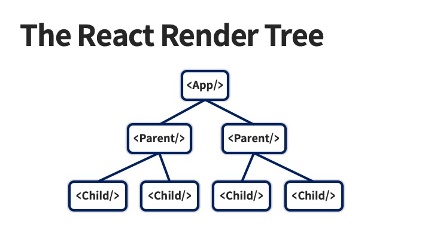

# SensorPage

센서 값들을 받아와 보여주는 페이지

---

## 리액트 계층구조



리액트 프로젝트는 이렇게 부모 컴포넌트가 자식 컴포넌트를 불러오는 계층 구조로 이루어져 있습니다.
코드를 살펴보면 SensorPage는 **SensorPage.jsx > List.jsx > Tile.jsx**로 이뤄진 계층 구조라는 점을 알 수 있습니다.

리액트를 쓰지 않고 이 페이지를 만들려면 센서 이름과 센서값만 다른 동일한 파란색 타일을 일일이 만들어주어야 할 것입니다.
하지만 우린 리액트의 계층구조 덕분에 번거러운 반복을 줄일 수 있습니다.

### prop

부모 컴포넌트는 **prop**을 통해 자식 컴포넌트에게 데이터를 전달할 수 있습니다. 여기서는 이 반복되는 Tile 안에 센서 값을 전달하는 데에 prop을 사용할 것입니다.

여러 센서에서 가져온 {name: <센서 이름>, value: <센서 값>} 데이터들로 이뤄진 배열을 SensorPage가 List에게 전달하면, List는 배열 속 각 센서의
데이터를 Tile에게 전달, Tile은 그 데이터로 타일들을 생성시킵니다.

그런데 우리가 prop으로 전달할 센서 데이터는 시간에 따라 바뀌는 동적 데이터입니다. 이대로 끝내게 된다면 우리가 만든 페이지는 변화하는 데이터를 반영해주지 못하고 바뀌는 데이터를 확인하려고 사용자는 새로고침
버튼을 무진장 눌러야 할 수도 있습니다.

### state

따라서 데이터가 변화하면 보여주는 값도 같이 갱신되어야 한다는 뜻이죠. 이것을 위해 필요한 것이 **상태 관리**랍니다.
센서 값이 갱신될 때마다 이를 보여주는 Tile 속 센서 값들도 변화해야 할 것입니다. 그것을 가능하게 해주는 것이 바로 **상태 관리**입니다.

```jsx
import {useState} from "react";

const [sensors, setSensors] = useState([
    {name: "센서 이름", value: "센서 값"},
]);
```

리액트의 useState라는 모듈을 사용해 상태 관리를 할 수 있습니다. 여기서 배열 첫번재 값이 우리가 상태 관리하려는 값, 두번째 값이 이 값을 설정시키는 함수입니다.

---

## 정리


부모 컴포넌트는 자식 컴포넌트에게 **prop**을 통해 데이터를 전달할 수 있고, 변화하는 데이터들은 **state**로 관리할 수 있다고 정리할 수 있겠습니다.